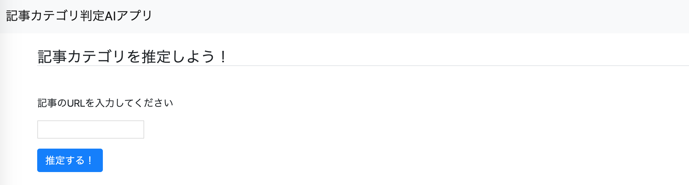
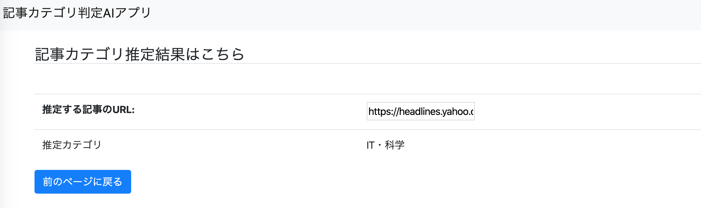
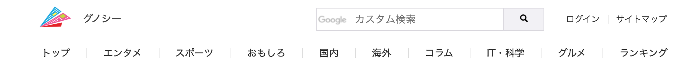

# 記事カテゴリ判定アプリ

## 1. 概要
記事のURLを入力したら、どのカテゴリに分類されるかを判定してくれるアプリ

**カテゴリ=['エンタメ', 'スポーツ', 'おもしろ', '国内', '海外', 'コラム', 'IT・科学', 'グルメ']**

　　　　　　　　　　　　　
　　　　　　　　　　　　　

試しに、ヤフーサイトのITカテゴリの記事を推定させてみる。                     

　　　　　　　　　　　　　
　　　　　　　　　　　　　
↓↓↓

___
## 2. 環境
- Docker 19.03.8
- Python 3.6.10
- Django 1.11
___
## 3. 大まかな手順

### **1. 学習データの収集**
[グノシー](https://gunosy.com/)の記事カテゴリ（エンタメ, スポーツ, おもしろ, 国内, 海外, コラム, IT・科学, グルメ）から学習データを集める。

なお各カテゴリ、最後のページに遷移した時に表示されているリンクを検証用データ(計160のリンク)として別に保持しておく。

`get_category_data.py`で
- word_ct.npy（学習データの全単語の集合）
- category_ct.npy（学習データのカテゴリー毎の単語数セット）
- vocabularies.npy（学習データのカテゴリー毎の記事数セット）
- verification_data.npy（検証用のデータ）

を作成する。

### **2. モデル構築**
`article_recognition_app/webapp/classify_app/models.py`にて教師あり学習の**ナイーブベイズ**を実装した。

結論、インプットとして渡された記事URLの単語を分解（形態素解析）した上で、

カテゴリ出現率 × カテゴリ内の単語出現率 = 対象記事（単語）のカテゴリ出現率
を求める。

この値が高いカテゴリを判定結果として返すというアルゴリズムである。

`※実装に当たっての注意した点`
>- 対象記事の中には学習データに存在しない単語もある。その結果、カテゴリ出現率がゼロになるのを防ぐために加算スムージングを適用させた。
>- 単語数が大量にあると、計算結果の分母が膨大な数になる。そこで対数比較を行うことでアンダーフローの対策をした。

### **3. モデルの精度**
検証用のデータを使って、各カテゴリ20個のリンク、計160個を推定させたところ100%となった。

今後は他社サイトの記事カテゴリ判定精度の検証も行っていかなければならない。

### **4. Webアプリ開発**
Webのフロント部分はデザイン面で不十分要素が多いので今後の課題である。
